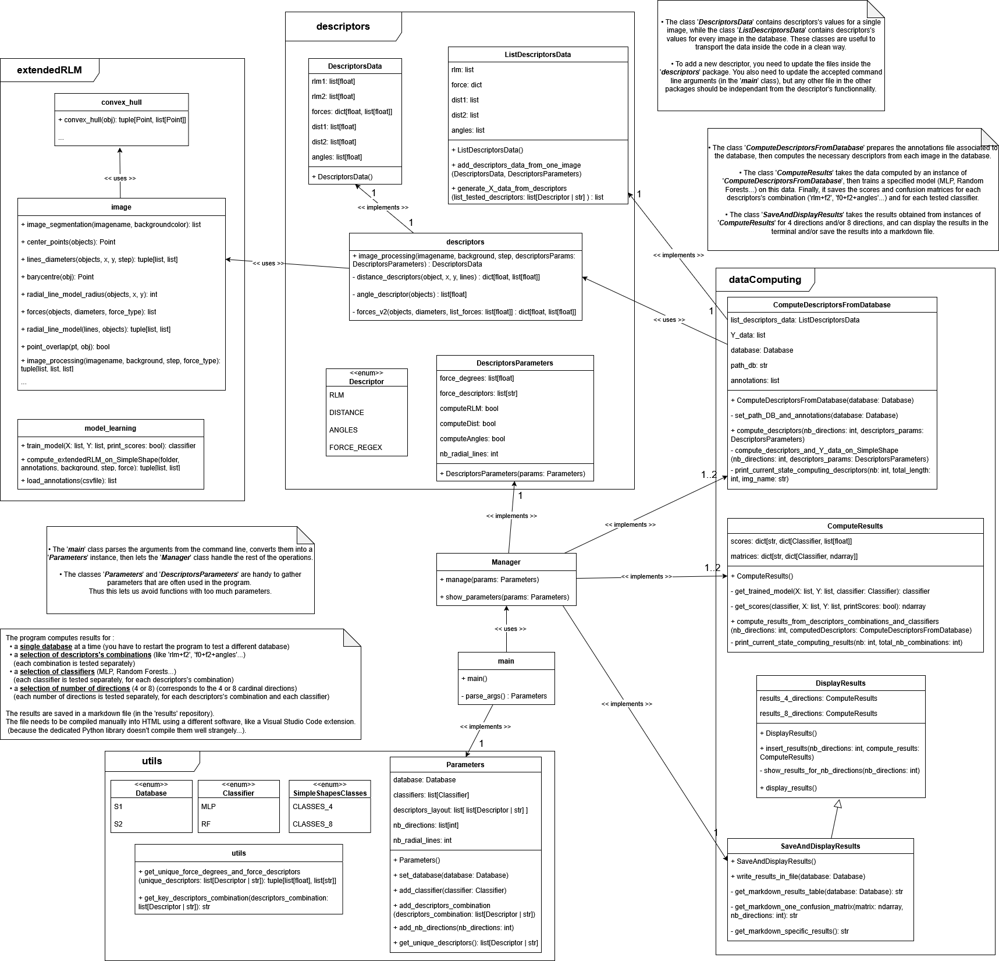

# First : fill in the 'images' and 'annotations' repositories

* ***'images'*** repository : images from SimpleShapes1, SimpleShapes2, SIG and SharvitSR
* ***'annotations'*** repository : annotations files for SimpleShapes1, SimpleShapes2, SIG and SharvitSR (you may need to rename some files)

# How to use the program

On the command line :

`py project.py`

Several options are available :

* `-c [{MLP, RF} ...]` : choose one or multiple classifiers (MLP for Multi-layer Perceptron, or RF for Random Forests) [default = MLP alone]
* `--db {S1, S2, SIG, SH}` : choose the database (S1 : SimpleShapes1, S2 : SimpleShapes2, SIG, SH : SharvitSR) [default = S1]
* `-d [{RLM, F0, F2, DIST, ANGLE} ...]` : choose the descriptors, or combinations of descriptors (like 'rlm+f2', 'f0+f-1.3+angle'...). You can input several combinations to test them seperately, all at once (RLM for the original descriptor, {F0, F2, F0.3, F-1...} for any force descriptor of a given value, DIST for the distance descriptor, ANGLE for the angle descriptor) [default = 'RLM+F2']
* `-n [{4, 8} ...]` : choose the number of directions to evaluate. Either 4 or 8 cardinal directions. You can input the two of them in order to test them separately.
* `-h` : show the help menu for the arguments

After computing the descriptors's values, and computing some results using classifiers trained on these values, the results are displayed in the terminal (mean score and std) and saved in a markdown file (mean score and std, scores from cross-validation, confusion matrix).

# Class diagram

